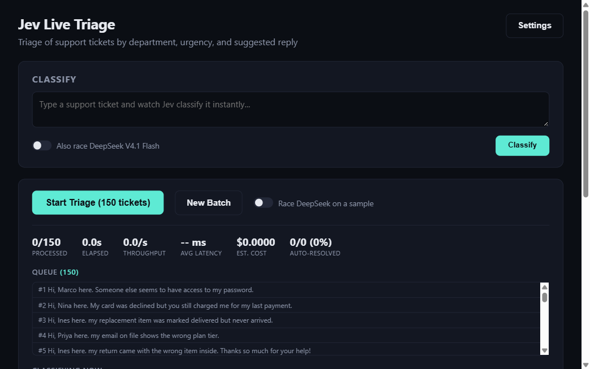
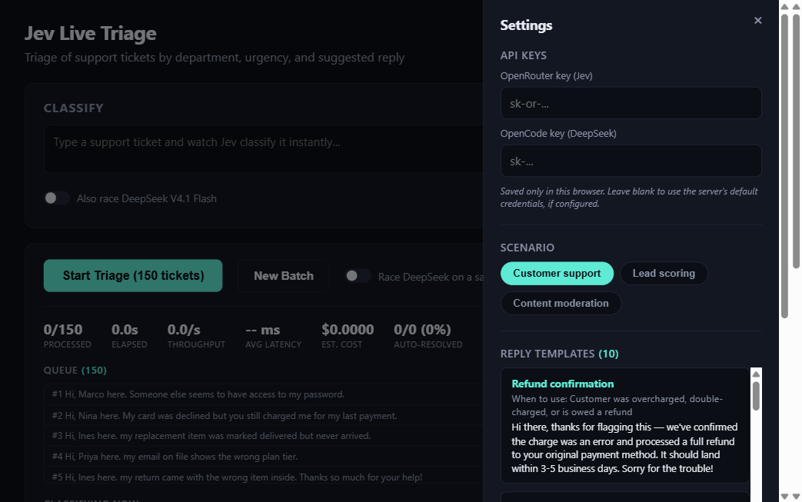
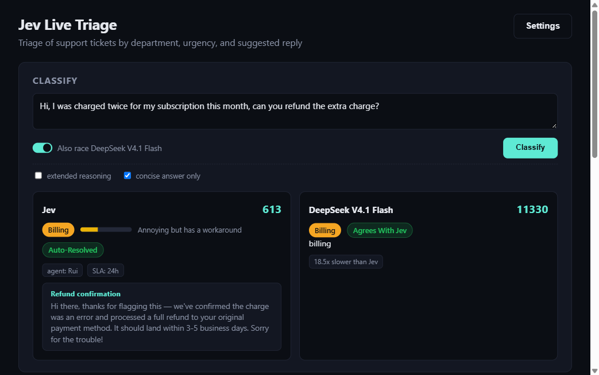
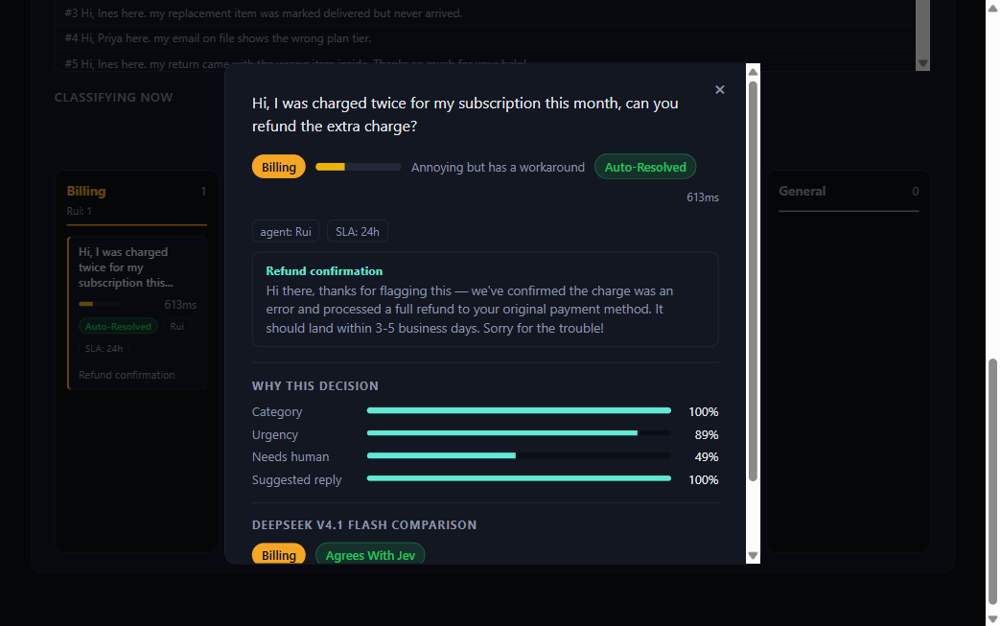
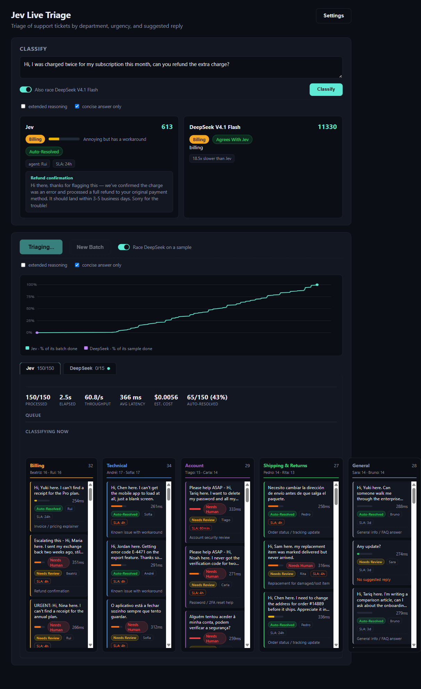
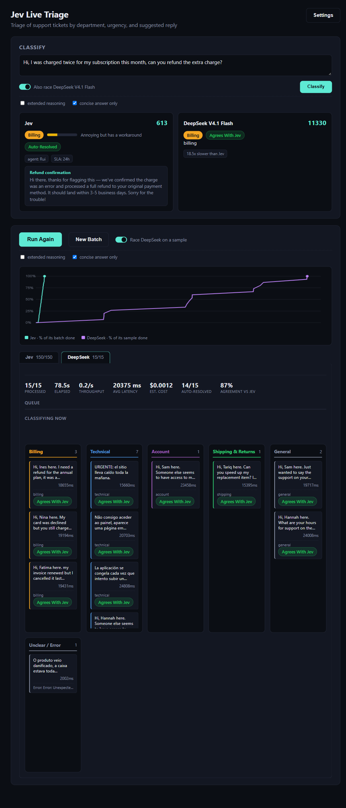

# Jev Live Triage

A demo of Jev, a decision-only classification model, triaging support tickets, leads, and moderation queues in real time. It can also race Jev head to head against DeepSeek V4.1 Flash on speed, cost, and agreement, for a single ticket or for a sample of a full batch.

## What this shows

Jev takes a piece of text and a set of typed questions (category, severity, action, confidence) and returns a structured decision in one API call. This project points 150 generated support tickets at it live in a browser, so the classification, routing, and reply drafting show up as a Kanban-style board while it works.

Two more scenarios ship with it: lead qualification and routing, and comment/review moderation. Each has its own categories, SLA rules, and canned reply templates.

## Features

- **Live classify**: type one ticket, get category, severity, suggested reply, and routing back in well under a second.
- **Batch triage**: run all 150 generated tickets through Jev at once, watch them land in category columns with live processed/elapsed/throughput/cost stats.
- **Jev vs DeepSeek race**: same tickets, two engines, each with its own board, queue, and metric tiles so results never get mixed onto the same card, plus a live chart plotting how far through its own batch each one is over time.
- **Three scenarios**: customer support, lead scoring, and content moderation. Switch between them in Settings.
- **Reply templates**: add a canned reply with its own trigger criteria, and Jev starts picking it on the next classification.
- **Per-browser API keys**: paste your own OpenRouter key (Jev) and OpenCode key (DeepSeek) into Settings. They're saved only in your browser and sent with each request, so anyone can run this against their own accounts without touching the server's configuration.

## Screenshots

### Main triage board


The default view: a ticket queue on the left, live stats across the top (processed, elapsed, throughput, avg latency, cost, auto-resolved), and a Kanban board of category columns that fills in as Jev classifies each ticket.

### Settings


Where API keys go (OpenRouter for Jev, OpenCode for DeepSeek), scenario switching, and reply template management all live.

### Live classify, racing DeepSeek


One ticket, two engines side by side. Jev resolved it automatically in 613ms with a suggested reply; DeepSeek took 18.5x longer and agreed on the category.

### Ticket detail


Clicking any card shows why Jev made its decision (confidence per field), and, when a race ran, how DeepSeek classified the same ticket.

### Batch race, Jev tab


With racing on, a chart tracks the percentage of each engine's own batch completed over time. Jev's board (150 tickets) and DeepSeek's board (a 15-ticket sample) sit in separate tabs, so their results never land on the same card.

### Batch race, DeepSeek tab


DeepSeek's own board, queue, and "classifying now" tray, with the same metric tiles as Jev's tab plus an agreement-vs-Jev tile. One ticket landed in "Unclear/Error" because its answer couldn't be parsed into a known category that run.

## Running it

Requirements:

- Node.js 20+
- An OpenRouter account with access to Jev (`~typesafe/jev-latest`). Get a key at openrouter.ai.
- [OpenCode CLI](https://opencode.ai) installed and on PATH, for the DeepSeek race. Either run `opencode auth login` once on the machine, or paste an OpenCode key into Settings per browser.

```bash
npm install
npm start
```

Open `http://localhost:5173`. If the server has no `credentials.json` configured, paste your OpenRouter key into Settings before classifying. The app works without any server-side setup at all; every key can come from the browser.

## How it works

- `server.js` is a single Node HTTP server. It calls Jev through OpenRouter's decisions API (`POST /api/alpha/decisions`), and calls DeepSeek by spawning the `opencode` CLI (`opencode run --model opencode-go/deepseek-v4.1-flash --format json`) and parsing its streamed JSON output for the answer and the cost OpenCode computed for that call.
- `lib/scenarios/` defines the three scenarios: categories, severity levels, actions, SLA hours, and canned agent rosters.
- `public/` is a single-page vanilla JS/HTML/CSS frontend. No build step, no framework.
- Live updates use Server-Sent Events: `/api/stream` for batches, `/api/race` for single-ticket races.

## What we found comparing the two

Numbers from the batch run shown in the screenshots above (150 Jev calls, 15 DeepSeek calls, same tickets):

| | Jev | DeepSeek V4.1 Flash (via OpenCode CLI) |
|---|---|---|
| Avg latency per call | 366ms | 20,375ms (~56x slower) |
| Cost per call | ~$0.0000373 | ~$0.00008 (~2x more, 2-3x across our runs) |
| Output | Structured decision: category, severity, confidence, action, agent, SLA | Free-text category guess only |

Two things worth knowing before reading too much into the cost ratio specifically:

1. **DeepSeek's cost here includes agent-framework overhead a raw API call wouldn't have.** OpenCode is a coding-agent CLI, and every `opencode run` loads a large system prompt (tool definitions, environment context) even for a plain classification question that never touches a tool. In one call we inspected directly, roughly 19,700 of its ~20,000 total tokens were this fixed overhead (billed at a cache-read discount, not full price, but present on every single call). A direct API call to DeepSeek without that wrapper would look considerably cheaper.
2. **Jev's decision-only design carries no equivalent overhead.** It returns a fixed set of typed fields in one call, with no chain-of-thought or agent scaffolding, which is most of why it comes out both faster and cheaper per call independent of the point above.

So: in every run we did, Jev was reliably faster and cheaper than DeepSeek V4.1 Flash. The exact multiplier depends heavily on how DeepSeek is invoked, though. This demo measures Jev against DeepSeek called through a coding-agent CLI, not against a raw DeepSeek API call, and that distinction matters more than any single ratio pulled from one run.
